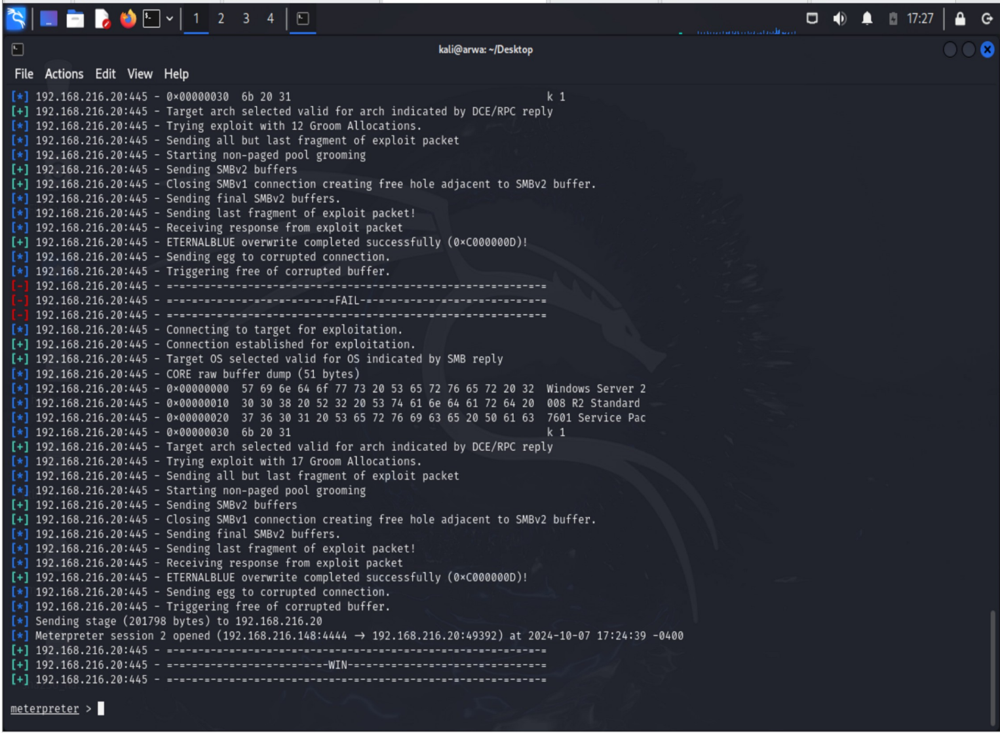

# Penetration-Testing-Lab-

## Description

The Penetration Testing Lab project simulates various penetration testing scenarios using a controlled lab environment. The lab setup consists of three virtual machines—Kali Linux (attacker machine), Metasploitable3 (vulnerable target), and a Windows Domain Controller (DC1)—designed to provide a realistic environment for practicing information gathering, vulnerability scanning, and exploitation techniques.

## **The main focus of the lab is to demonstrate**:

- Information Gathering using Nmap to discover live hosts and perform OS fingerprinting.
- Vulnerability Scanning to identify services and potential exploits using tools like Metasploit.
- Exploitation of known vulnerabilities such as the MS17-010 (EternalBlue), which allows remote code execution on the target.
- Database Enumeration through brute-forcing credentials to access MySQL databases and extract sensitive information.
- Service Scanning and Exploitation using Nmap scripts to identify and exploit additional services.
- The lab documents all the steps and commands used, making it an excellent resource for beginners looking to understand penetration testing workflows. 

## **Objectives**
- Understand how to set up a virtual lab for penetration testing.
- Practice various reconnaissance and scanning techniques.
- Exploit known vulnerabilities to gain access to systems.
- Conduct database enumeration to extract information from vulnerable servers.
- Document findings and create a reusable script for automation.

## Tools & Technologies
### Primary Tools
- **Kali Linux**: The main tool for running penetration testing operations.
- **Metasploitable3**: A vulnerable target machine to test and practice attacks.
- **Windows DC1**: A Windows Domain Controller for testing domain-based attacks.

### Auxiliary Tools
- **Nmap**: For scanning networks and identifying active hosts.
- **Metasploit Framework**: Used for conducting detailed exploitation.
- **TheHarvester and Sublist3r**: For gathering information and enumeration.
- **Nessus**: For vulnerability scanning and assessment.
- **Google Dorking**: For finding specific information using custom search queries

## **Project Commands Script** 
The project commands have been consolidated into a single script file named penetration_lab_script.sh. This file includes all the necessary commands executed during the lab, covering:

- Information gathering using `nmap` 
- Scanning for vulnerabilities using `nmap` and Metasploit
- Running exploits against identified vulnerabilities
- Performing database enumeration and extraction

## **Screenshot**
- **TheHarvester Scan**: Executed a scan on the `apple.com` domain using theHarvester with Google as the data source.

 

- **Successful Exploit Output**:
  - *Description*: Demonstrates a successful execution of the MS17-010 exploit.

